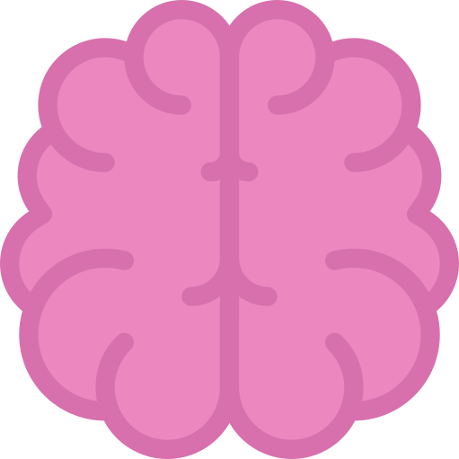

    

<h1 align="center">DS Mindmap 🚀</h1>

Mindmap to becoming an Data Science Expert in 2022

    
    

 

## 👀 Owerviev
I started my journey in data science with programming, solving algorithms, and only then did I get carried away by the wonderful world of mathematics, statistics and probability theory. Therefore, my choice fell on the mindmap, not the roadmap. The path is different for everyone and the start can be different too. And if on the road map we are clearly indicated from which point we need to start, then in the mindmap we can choose the vector that we like best and not give up halfway through.

## 🗺 Map
<a href="https://www.plantuml.com/plantuml/svg/jLXTZjp64NxdAJem44cs5t84n8W3mV3kpFuetf_n3gKWC0IZfbb3beRiPggBgnq51dA307dCIwwH4-GwoH7ItSETeTXSnmYGULYowx--wgvgxZTEWAKXKpJGPjaJDRF6e1OofGArOFlEBrHUOOFPBoGyL5i3cIp8pj5ffbR86cNNobjGJhOrkknbV7wTzORd12L3e_wKAVypji3mslykBDC7QmJguvfAqw0HfT48SXJvCVinU_cyjnUyvYGr_lElmQDKgDX2Z5q2MRrqz05_--illfw3W5fgGgDHlVZYnGlrxx__xS_UaEVlx2n3vkffSCNuBFlq-qykgQpad17DMpNK3-81Yv134v1PCHXTgQSrhkLPTdJq_ITh__lggxT3gSmp1fnBC6K79Rf07cfifR8c40VK7zJYTF6Rb0Xwuqruf8r_i3ULI6mNb5AF3MXh2XYvddtssOXogvwUK1cJVpPcOTdLmEhqlcLqZgnnemnVXPg1Zjk1mliQT9BkxUaoLqbY5tc-U1x-B1FMyU9LIkkaGYEa8JXByxq90Ydv186HK_hlVfydBcQth-S9yPspPfJFjx3UZ74zPsYhxov7yFYOR0E2XNfjI5IEJiO81jnNu1BGbjxOE9PRU1_ewhiEcT2bUyKwAHcdLA-sdZfoSMtLfAWrfPsV9FIRswk4Tbg34z8EWNKrocpswlbideqKpad6fBdL6-J4z1-EhzBOPhPfhSEnYKiotNqgV9bkepVKZ9KNR3KwfsfRbkaPNW13GMNZnch7BBG6BMaPNay4FZzBjzPIkDFICTIgxvOJ9KLXKWObPUKCnb4u3O-hdzGUt0Ts6XHgSa4_XrLeuGdRKMbK2oB8vb4saz7KJkZVt2ooHrB6GhM3jfbKsGYPpdOkDXKl5h8SIxqIz0pBJe4fr3cQVfaKIiVoNjc2reJifkq461PinMfRJqqwQbhB0aOKrALbaghPEIv0GBc7l5mS3S5oFFy7qL_su-KWw2KFeZyCPF_rZxy4tf2vj1pdynLAPGitPf_PZWbPITWIQyjDek_3h_5UDL5_p9rl3JIaXvDiB7ABkkEmLyQCAsXliUWq9YulZWzG9HxftSO9mnFtVv0P8Pi0dsGWJ3gX7qw7C2RPdP01tgeyPOLcjC72FvoCMHVWglwmJT-cT4K6LOt09fHRR4lQPP_wYygNNsgzNhzLLxtCPI-JUUw0VTX5WNvW-7fqBV8TEIpszeF8K2OC_7xGUzQ8vzD2u9yKER7MXMsQS0vO1i3SX75mpdwkRgaeCObgLdikhVlHdx1lLl72EaT17GJ-1--sf336akH6-8KEeDwW5iiFTPW00RRe28pIVTZ8ISZN6Bg-VyXxovif6thJicsXXCSombPT7igOG7PzFK4zFmxKKSN9h2rhZ7TmOQ1eCIr1vmHvkhOdovatdD0l21dOewIXLled36oE6WJZ7ffJYdoBMdZ2I8gesI7gKYFVsieQD0dqayXUNuVZcBDtbmAcRTEWAP2Lsph1ngLesRg65OFG7QerrO_4VB5TCHLXC64zPSH8gCa9E2mERkE6I0vtZlUYhcBjdbzVBh9HLuWkGdNrnakCb7lk7pkeIRQX2apQ_PTJ6APgnw2tsSHXWjY1IFjtDvdOkdF1Hkoyzud0CIEeBY8yw_WE4u6pNwcbjfmohX1yP2jdwqvGdJ9RdfPP-cmPYrvax9zuNTlt2KoNPvuwGZREbZjo0RmF4PcnMlmoS9yhNG6B6wddrlQb7zxvukUXzwTgMZ5mm7Wa0QO0bv2NcZOaHx4l9CoR5itiJMfgcrlMLKBFqJYxms74kO32sZPrtW9l4khXUZ0nx_0Uj2Yt--8EwQZJZoc9XbGuk8cHKGr8Z3tifMg7YDyVdIaWD3Ie0oMGviXq5m-aUo3DxEvEjExCO6xu--3kojdNPJ_ue2vnnT1B3VTkM2x9xBwL2zJn6uK69lkPaUqrAsn0Oby40_NMKV3LEsj8zgjpXeBGI8J1FtiBnq79wpjrZZQSrstFc9FJZ8BHHxPFSqK6nCPJtKUB4g2qNl5dOEm4X9pqwcevN0PhYwCtK7VOhqxlGxl6Gjtrn3wm5da_M7TDW8fGvNZ5Po_i3hB2jEhwHfSIbTTp9Dj9dcpRGOahOD22l8itP5SarcDBS1rZvC_Gn5cJemdXHIUzZ3cy5pHOsQ9FSwzSKqCzmjZiCsR66ZxAAcTezujmHtVMF76g1OR2tl-SshHiLx2YkeT3BORhO7P82UyjiX2wyOPXC8LjVCsOulNqKAOYxcIeKzF3xxH9_Vuoz024UXe-JReQdlNStCh7TjNPJY3Bla5JzFz9_0y0"></a>

The whole map was described using the PlantUML language, you can see the code [here](https://github.com/AlekseevDanil/Mindmap-Data-Science/blob/main/assets/scr/map.puml).

## 🎒 Useful sources
### Competition grounds
| **Title** | **Description** |
|:----------|:----------|
| [LeetCode](https://leetcode.com) | Platform to help you enhance your skills, expand your knowledge and prepare for technical interviews. |
| [Kaggle](https://kaggle.com) | Online community platform for data scientists and machine learning enthusiasts. |
| [StackExchange](https://stackexchange.com/sites) | Network of question-and-answer (Q&A) websites on topics in diverse fields. |
| [Stepik](https://stepik.org/learn) | Educational platform and constructor of free and paid open online courses and lessons. |

### Knowledge certification
| **URL** | **Title** | **Price** |
|:----------|:----------|:----------|
| [Amazone AWS](https://aws.amazon.com/ru/certification/certified-machine-learning-specialty/) | AWS Certified Machine Learning | 300$ |
| [Google](https://cloud.google.com/certification/data-engineer) | Professional Data Engineer | 200$ |
| [IBM](https://www.coursera.org/professional-certificates/ibm-data-science) | IBM Data Science Professional Certificate | Free |
| [Tensoflow](https://www.tensorflow.org/certificate) | Tensorflow Developer Certificate | 100$ |
| [PostgreSQL](https://www.enterprisedb.com/course/postgresql-12-associate-certification) | PostgreSQL 12 Associate Certification | 200$ |

### Interesting to look
| **URL** | **Direction** | **Title** |
|:----------|:----------|:----------|
| [3blue1brown](https://www.youtube.com/c/3blue1brown) | Math | Combination of math and entertainment, depending on your disposition. |
| [freeCodeCamp.org](https://www.youtube.com/channel/UC8butISFwT-Wl7EV0hUK0BQ) | Programming | Learn to code for free. |

## 🙌 Contribution
Mindmap is constantly being developed and improved, so if you have any ideas or improvements to the map, I will be very happy about them!

- Open pull request with improvements
- Discuss ideas in issues
- Spread the word
- Reach out with any feedback
